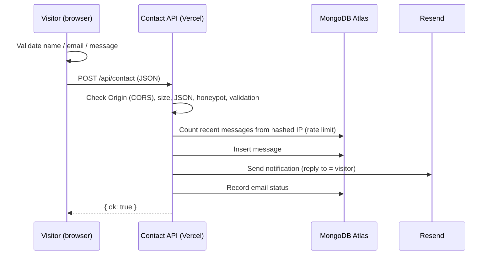

# Stanislav Georgiev — Portfolio

Personal developer portfolio for **Stanislav Georgiev, Android Developer**, served at
**https://slaviboy.github.io/CV/**.

Built with Vue 3, TypeScript, Vite and Tailwind CSS, deployed to GitHub Pages by GitHub Actions.
The contact form talks to a small, separately deployed serverless API that stores messages in
MongoDB Atlas and sends an email notification — no secrets ever reach the browser.

```
Vue app (GitHub Pages)  ──POST /api/contact──▶  Serverless API (Vercel)  ──▶  MongoDB Atlas
   public, static                                  secrets live here      └──▶  Resend (email)
```

---

## Contents

1. [Tech stack](#tech-stack)
2. [Project structure](#project-structure)
3. [Local development](#local-development)
4. [Building](#building)
5. [Editing content](#editing-content)
6. [GitHub Pages configuration](#github-pages-configuration)
7. [GitHub Actions deployment](#github-actions-deployment)
8. [Environment variables](#environment-variables)
9. [How the contact form backend works](#how-the-contact-form-backend-works)
10. [MongoDB Atlas setup](#mongodb-atlas-setup)
11. [Deploying the contact API](#deploying-the-contact-api)
12. [Deploying / updating the website](#deploying--updating-the-website)
13. [Quality, accessibility & performance](#quality-accessibility--performance)
14. [Content sources](#content-sources)

---

## Tech stack

| Area      | Choice                                                                                       |
| --------- | -------------------------------------------------------------------------------------------- |
| Framework | Vue 3 (`<script setup>`, Composition API), TypeScript (strict)                               |
| Build     | Vite 8                                                                                       |
| Styling   | Tailwind CSS v4 with semantic design tokens (CSS variables) for light/dark themes            |
| Icons     | [`@lucide/vue`](https://lucide.dev) (tree-shaken) + three hand-drawn brand marks             |
| Fonts     | Geist & Geist Mono, self-hosted via Fontsource (no third-party font requests)               |
| Hero      | `<canvas>` Delaunay mesh using [`delaunator`](https://github.com/mapbox/delaunator) (~3 kB)   |
| Quality   | ESLint + Oxlint, Prettier, `vue-tsc`, Vitest + Vue Test Utils                                |
| Backend   | Node.js serverless function (Web `Request`/`Response`), MongoDB Node driver, Resend REST API |

Vue Router is intentionally not used: the site is a single page with anchor navigation, so a
router would add weight without adding value.

## Project structure

```
.
├── .github/workflows/
│   ├── deploy.yml           # Lint, test, build and deploy the site to GitHub Pages
│   └── contact-api.yml      # Type-check and test the contact API
├── public/                  # Copied as-is: favicon, OG image, robots.txt, sitemap, 404, CV PDF
├── src/
│   ├── assets/images/       # Optimised WebP screenshots (projects/, ai/) and portrait
│   ├── components/          # Navbar, Hero, HeroMesh, About, Skills, Experience, Projects,
│   │   │                    # AiDevelopment, ProjectCard, Education, Contact, Footer,
│   │   │                    # SectionHeading, ThemeToggle
│   │   └── icons/           # BrandIcon (GitHub/LinkedIn/Google Play), LogoMark
│   ├── composables/         # useTheme, useContactForm, useActiveSection, useReducedMotion
│   ├── data/
│   │   ├── portfolio.ts     # ← all site content lives here
│   │   └── sections.ts      # Section order + navigation (hides empty sections)
│   ├── directives/reveal.ts # v-reveal scroll animation
│   ├── types/               # Portfolio + contact types
│   ├── utils/date.ts
│   ├── views/HomeView.vue
│   ├── App.vue
│   ├── main.ts
│   └── style.css            # Tailwind + theme tokens
├── server/                  # Contact API — an independent project (own package.json)
│   ├── api/contact.ts       # Vercel Function entry point
│   ├── src/
│   │   ├── handler.ts       # Platform-agnostic request handler (CORS, validation, rate limit)
│   │   ├── validation.ts    # Shared validation rules (also imported by the frontend)
│   │   ├── config.ts        # Environment variable parsing
│   │   ├── mongoStore.ts    # MongoDB Atlas storage
│   │   ├── resendMailer.ts  # Email notifications
│   │   └── *.test.ts
│   ├── scripts/dev-server.ts
│   └── .env.example
├── index.html               # SEO meta tags, Open Graph, JSON-LD, no-flash theme script
├── vite.config.ts           # base: '/CV/'
└── .env.example
```

## Local development

**Prerequisites:** Node.js 24 (see `.nvmrc`; 22.18+ also works) and npm.

```bash
# 1. Install dependencies
npm install

# 2. Start the dev server
npm run dev
```

Open **http://localhost:5173/CV/** — note the `/CV/` path, which mirrors GitHub Pages.

The site works without the contact API; the form then shows a friendly message pointing visitors
to the email address. To run the API locally as well:

```bash
cp .env.example .env.local          # sets VITE_CONTACT_API_URL=http://localhost:8787/api/contact

cd server
npm install
cp .env.example .env                # fill in MONGODB_URI and/or RESEND_API_KEY, IP_HASH_SALT…
npm run dev                         # → http://localhost:8787/api/contact
```

> Tip: for a throwaway local database run
> `docker run --rm -p 27017:27017 mongo:8` and use `MONGODB_URI=mongodb://localhost:27017`.

### Scripts

| Command                | What it does                                                   |
| ---------------------- | -------------------------------------------------------------- |
| `npm run dev`          | Vite dev server with hot reload                                |
| `npm run build`        | Type-check and build to `dist/`                                |
| `npm run build-only`   | Build without type-checking                                    |
| `npm run preview`      | Serve `dist/` at http://localhost:4173/CV/                     |
| `npm run type-check`   | `vue-tsc` across app, config and test files                    |
| `npm run lint`         | Oxlint + ESLint, auto-fixing                                   |
| `npm run lint:check`   | Oxlint + ESLint, no fixes, fails on warnings (used in CI)      |
| `npm run format`       | Prettier (writes)                                              |
| `npm run format:check` | Prettier (checks only, used in CI)                             |
| `npm test`             | Vitest, single run (`npm run test:unit` for watch mode)        |
| `server/: npm run dev` | Local contact API on port 8787                                 |
| `server/: npm test`    | API unit tests                                                 |

## Building

```bash
npm run build      # outputs to dist/
npm run preview    # check the production build at http://localhost:4173/CV/
```

`VITE_CONTACT_API_URL` is read at build time, so set it in the environment (or `.env.local`)
before building if you want the form to be active in that build.

### Testing the production build locally

Because of `base: '/CV/'`, the built `dist/index.html` loads its files from `/CV/assets/…`.
It therefore shows a **blank page** when opened directly (`file://…`) or through a static server
at the wrong path, e.g. VS Code Live Server's `http://127.0.0.1:5501/dist/index.html` — every
`/CV/…` request returns 404. Always open the site under `/CV/`:

- **`npm run preview`** → http://localhost:4173/CV/ (recommended — identical to GitHub Pages).
- **VS Code Live Server:** `.vscode/settings.json` mounts `dist/` at `/CV`, so after
  `npm run build` start Live Server and open **http://127.0.0.1:5501/CV/** (not `/dist/…`).

## Editing content

All content is in **`src/data/portfolio.ts`** — components only render it.

- **Projects:** add an entry to `projects`. Screenshots go in `src/assets/images/projects/`
  and are imported at the top of the file. `image.src` is the default screenshot; the optional
  `image.darkSrc` is shown in the dark theme.
- **AI development (“Building with Claude”):** edit `aiDevelopment.intro` and
  `aiDevelopment.projects` (same shape as `projects`; images in `src/assets/images/ai/`, 32:21).
  Cards get a “Built with Claude” badge; the section and its **AI** nav link hide when the list is
  empty.
- **Experience:** the original CV contains no employment history, so `experience` is empty and the
  section is hidden. Add entries and the section **and** its navigation link appear automatically.
- **Certifications:** same pattern — entries render under Education when present.
- **CV PDF:** replace `public/cv/Stanislav-Georgiev-CV.pdf`.
- **SEO text:** title/description/Open Graph tags live in `index.html`; the social preview image
  is `public/og-image.png` (1200×630).

## GitHub Pages configuration

This is a **repository site**: the repository is named `CV`, so the site lives under `/CV/`.

- `vite.config.ts` sets `base: '/CV/'`, which prefixes every asset URL.
- `index.html` uses `%BASE_URL%` for the favicon links; images imported in code are resolved by
  Vite automatically, and the CV link uses `import.meta.env.BASE_URL`.
- Canonical, Open Graph, sitemap, robots and `404.html` URLs use the absolute address
  `https://slaviboy.github.io/CV/`.

**One-time setup in GitHub:** _Settings → Pages → Build and deployment → Source:_
**GitHub Actions**.

> Renaming the repository or using a custom domain? Update `base` in `vite.config.ts` (use `'/'`
> for a custom domain or a `<user>.github.io` repository), plus the absolute URLs in `index.html`,
> `public/robots.txt`, `public/sitemap.xml`, `public/404.html` and `SITE_URL` in
> `src/data/portfolio.ts`.

## GitHub Actions deployment

`.github/workflows/deploy.yml` runs on every push to `main` and can be started manually
(_Actions → Deploy to GitHub Pages → Run workflow_). It:

1. Checks out the repository
2. Sets up Node.js (version from `.nvmrc`) with npm caching
3. Installs dependencies with `npm ci`
4. Runs lint, format check, type-check and unit tests
5. Builds the app (injecting the public `CONTACT_API_URL` repository variable)
6. Uploads `dist/` as a Pages artifact (`actions/upload-pages-artifact`)
7. Deploys it with `actions/deploy-pages`

It only uses the automatically provided, short-lived `GITHUB_TOKEN` with the minimum Pages
permissions — there are no hard-coded secrets.

`.github/workflows/contact-api.yml` type-checks and tests `server/` whenever it changes.

## Environment variables

### Frontend (public — embedded in the JavaScript bundle)

| Variable               | Where                                                   | Example                                        |
| ---------------------- | ------------------------------------------------------- | ---------------------------------------------- |
| `VITE_CONTACT_API_URL` | `.env.local` locally; repo variable `CONTACT_API_URL` in CI | `https://your-api.vercel.app/api/contact`   |

Set the CI value under _Settings → Secrets and variables → Actions → **Variables**_ →
`CONTACT_API_URL`. It is a public URL, so a _variable_ (not a secret) is correct.

> ⚠️ Anything prefixed with `VITE_` is visible to every visitor. Never put credentials there.

### Contact API (secret — set in the hosting provider, never committed)

| Variable                     | Required                     | Description                                                                 |
| ---------------------------- | ---------------------------- | --------------------------------------------------------------------------- |
| `ALLOWED_ORIGINS`            | yes                          | Comma-separated origins allowed to call the API, e.g. `https://slaviboy.github.io` |
| `MONGODB_URI`                | one of Mongo/Resend          | Atlas connection string                                                     |
| `MONGODB_DB`                 | no (`portfolio`)             | Database name                                                               |
| `IP_HASH_SALT`               | yes, with MongoDB            | Random 16+ char secret for hashing visitor IPs (rate limiting)              |
| `RATE_LIMIT_MAX`             | no (`5`)                     | Messages allowed per IP per window                                          |
| `RATE_LIMIT_WINDOW_MINUTES`  | no (`60`)                    | Rate-limit window                                                           |
| `RESEND_API_KEY`             | one of Mongo/Resend          | Resend API key for email notifications                                      |
| `CONTACT_TO_EMAIL`           | yes, with Resend             | Recipient — `slavi94slavi94@gmail.com`                                      |
| `CONTACT_FROM_EMAIL`         | no                           | Sender, default `Portfolio Contact <onboarding@resend.dev>`                 |

See `server/.env.example` for a documented template.

## How the contact form backend works

GitHub Pages only serves static files, so the form posts to a separate serverless function:



**Security & robustness**

- **No secrets in the frontend.** The browser only knows the public API URL. The MongoDB URI and
  Resend key exist solely as environment variables of the function.
- **Shared validation.** `server/src/validation.ts` is used by the API (authoritative) and imported
  by the Vue form for instant feedback, so the rules never drift.
- **CORS allow-list** (`ALLOWED_ORIGINS`); requests from other origins are rejected.
- **Input limits:** JSON only, 16 KB max body, field length limits, control characters rejected
  (prevents header-style injection into the email subject).
- **Spam protection:** hidden honeypot field + per-IP rate limiting stored in MongoDB.
- **Privacy:** raw IP addresses are never stored — only a salted SHA-256 hash. The notification
  email's HTML is escaped.
- **Resilience:** a message counts as delivered if it was stored _or_ emailed; each outcome is
  logged, and `emailStatus` in the database records whether the notification went out.

**Why a database?** It provides real value here: every message is kept even if email delivery
fails, and it backs the rate limiter. If you prefer email only, simply omit `MONGODB_URI`
(rate limiting is then disabled); likewise, omitting `RESEND_API_KEY` stores messages without
sending email.

> The previously considered MongoDB Realm / Atlas App Services (Data API, Functions, HTTPS
> endpoints) is deprecated and is **not** used. The API connects with the official MongoDB Node.js
> driver.

**Portability:** `handler.ts` uses only Web-standard `Request`/`Response`, so the same code runs on
Netlify Functions, other Node hosts or a plain Node server (see `scripts/dev-server.ts`). Only the
tiny `api/contact.ts` entry file is Vercel-specific. If you move away from Vercel, make sure the
platform sets a trustworthy client-IP header (`x-real-ip` / `x-forwarded-for`).

## MongoDB Atlas setup

1. Create a free account at [cloud.mongodb.com](https://cloud.mongodb.com) and a free **M0**
   cluster.
2. **Database Access → Add New Database User:** password authentication, role
   _Specific privileges → `readWrite` on database `portfolio`_ (least privilege). Generate a strong
   password.
3. **Network Access → Add IP Address:** serverless platforms use changing IPs, so allow
   `0.0.0.0/0` (access still requires the credentials), or use the
   [Vercel ↔ MongoDB Atlas integration](https://vercel.com/marketplace/mongodbatlas).
4. **Database → Connect → Drivers → Node.js:** copy the `mongodb+srv://…` connection string, insert
   the password, and store it as `MONGODB_URI` in the API's environment.
5. That's it — the `contact_messages` collection and its indexes (`ipHash + createdAt`,
   `createdAt`) are created automatically on the first request.

Each stored document looks like:

```json
{
  "name": "Ada Lovelace",
  "email": "ada@example.com",
  "message": "Hello!",
  "createdAt": "2026-09-12T10:00:00.000Z",
  "ipHash": "f4c7…ab32",
  "userAgent": "Mozilla/5.0 …",
  "origin": "https://slaviboy.github.io",
  "emailStatus": "sent"
}
```

Browse messages in Atlas under _Database → Browse Collections → portfolio.contact_messages_.
To auto-delete old messages, add a TTL index on `createdAt` (e.g. `expireAfterSeconds: 31536000`).

## Deploying the contact API

The API is deployed independently of the website. Using **Vercel** (free Hobby plan is enough):

1. Import this repository at [vercel.com/new](https://vercel.com/new).
2. Set **Root Directory** to `server`. Framework preset: **Other**. No build command is needed.
3. Add the environment variables from the table above (Production, and Preview if wanted):
   `ALLOWED_ORIGINS=https://slaviboy.github.io`, `MONGODB_URI`, `IP_HASH_SALT`,
   `RESEND_API_KEY`, `CONTACT_TO_EMAIL=slavi94slavi94@gmail.com`, …
4. Deploy. The endpoint is `https://<project>.vercel.app/api/contact`.
5. In GitHub, add the repository **variable** `CONTACT_API_URL` with that URL and re-run the
   _Deploy to GitHub Pages_ workflow.

**Email with Resend**

1. Create an account at [resend.com](https://resend.com) and an API key (_Sending access_ is
   enough) → `RESEND_API_KEY`.
2. Without a verified domain, Resend's test sender `onboarding@resend.dev` can only deliver to the
   email address of your Resend account — so sign up with `slavi94slavi94@gmail.com`, or verify a
   domain you own and set `CONTACT_FROM_EMAIL="Portfolio <contact@your-domain.com>"`.
3. Replying to a notification replies directly to the visitor (`reply_to` is set).

Verify the deployment:

```bash
curl -i -X POST https://<project>.vercel.app/api/contact \
  -H "Origin: https://slaviboy.github.io" -H "Content-Type: application/json" \
  -d '{"name":"Test","email":"test@example.com","message":"Hello from curl"}'
# → HTTP/2 200  {"ok":true}
```

## Deploying / updating the website

1. Edit content in `src/data/portfolio.ts` (or components/styles).
2. Check locally: `npm run dev`, then `npm run lint:check && npm run type-check && npm test`.
3. Commit and push to `main`:

   ```bash
   git add -A
   git commit -m "Update portfolio content"
   git push origin main
   ```

4. The **Deploy to GitHub Pages** workflow builds and publishes automatically; follow it under the
   _Actions_ tab. The site updates at https://slaviboy.github.io/CV/ within a minute or two.

## Quality, accessibility & performance

- **Accessibility:** semantic landmarks and heading hierarchy (one `h1`, `h2` per section), skip
  link, visible focus rings, labelled icon buttons, `aria-current` in the navigation, keyboard- and
  Escape-friendly mobile menu, form errors linked with `aria-describedby`/`aria-invalid`, focus
  moved to the first invalid field, live regions for form status, `prefers-reduced-motion`
  respected everywhere (including the canvas), WCAG-AA contrast in both themes.
- **Theme:** follows the OS setting until the visitor picks one; the choice is stored in
  `localStorage`. An inline script applies it before first paint (no flash), and switching uses a
  subtle View Transition cross-fade where supported.
- **Performance:** ~52 kB of gzipped JavaScript, self-hosted fonts with `font-display: swap` and
  unicode-range subsets, WebP screenshots (~170 kB total vs ~1.3 MB of original PNGs) that are
  lazy-loaded with explicit dimensions (no layout shift), and a hero canvas capped at 30 fps that
  pauses when off-screen or in a background tab.
- **SEO:** title, description, canonical URL, Open Graph and Twitter/X cards with a 1200×630 image,
  JSON-LD `Person` data, `robots.txt` and `sitemap.xml`.
- **Tests:** frontend (contact form behaviour, data integrity, theme, dates) and API (handler,
  CORS, honeypot, rate limiting, delivery fallbacks, config, validation, email escaping).

## Content sources

All information comes from the existing CV and the profiles it links to — nothing is invented:

- **Original site** (https://slaviboy.github.io/CV/, including `assets/json/en.json`): name, title,
  intro, stats, skills, projects, screenshots, contact details, social links.
- **CV PDF** linked from the site: education, programming languages, Android skills, spoken
  languages, location.
- **GitHub repositories / Google Play listings** linked from the CV: project descriptions and
  technologies, plus the open-source library list (taken from the GitHub profile).
- **Added at the owner's request:** the Realm skill and the “Building with Claude” AI section with
  XDesign, Galaxy Collision, Fluid Simulation and DrumPadMachine — descriptions, technologies and
  screenshots come from each repository's README (the XDesign image is a capture of its live demo).

Deliberate omissions and adjustments:

- Self-rated skill scores (x/10) are not shown — they differ between the site and the PDF.
- Home address, phone number and date of birth from the PDF are not displayed on the page.
  (They remain inside the downloadable PDF — replace `public/cv/` with a redacted version if
  preferred.)
- Several apps from the original CV are no longer on Google Play (their listings return 404), so
  their store links were removed; the Weather app's Google Play listing was added.
- There is no Experience section because the CV lists no employers.
